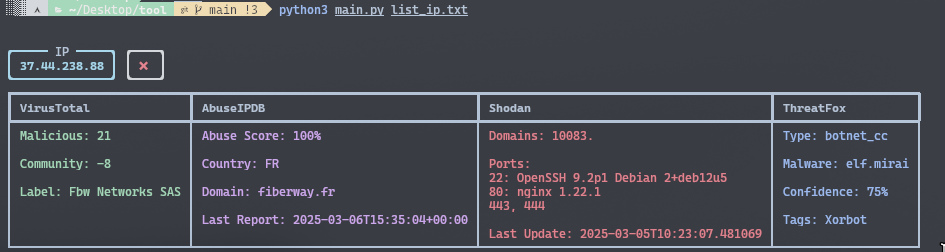

# CTI Tool README

## ⚠️ Advertising

⚠️ **Advertising :** This tool is intended for **security research and analysis**. Make sure you comply with the **terms of use** of each API service.

## Installation 🛠️

To install this project, please follow these steps:

1. Ensure you have **Python 3** installed on your system.
2. Create a **Python virtual environment**:

   ```bash
   python3 -m venv .env
   ```

3. Activate the virtual environment:

   ```bash
   source .env/bin/activate
   ```

4. Install the dependencies using pip:

   ```bash
   pip3 install -r requirements.txt
   ```

5. Add your **API keys** in `config.json` and keep it **excluded from Git** with `.gitignore`.

## Usage

Create a `.txt` file containing a list of IPs or domains.

```bash
python3 main.py /path/to/your/list_ip.txt or /path/to/your/list_domains.txt

# Show help message
python3 main.py -h 
```

### **Usage with malware tags**

You can also **search for domains linked to a malware tag**:

```bash
python3 main.py tag:Mirai
```

## 🌐 Global Functioning

This script helps you check **IP addresses and domains** against multiple threat intelligence sources. It queries various APIs to get information about potential threats, reputation, and associated risks.

### **How It Works** 🚀

1. **Input:**  
   - The script reads from a file (`list_ip.txt` or `list_domain.txt`).
   - Each line contains either an **IP address** or a **domain name**.
   - It automatically detects whether the input is an IP or a domain.

2. **Analysis:**  
   - The script queries multiple security APIs:
     - **VirusTotal** (same for IP and domains) → Checks reputation, malicious score and give the label.
     - **AbuseIPDB** → Retrieves the abuse confidence score, the country, the domain and the last report.
     - **Shodan** → Fetches open ports and services, and give the domains and last update.
     - **ThreatFox** → Detects potential malware threats. Give the type, the malware name, the confidence score and the tags.
     - **URLHaus** Finds domains linked to a given malware tag.

3. **Output:**
   - The results are displayed **in a structured table** using `rich`.
   - A **checkmark (✅) or a red cross (❌)** indicates whether an IP or domain is flagged as malicious.
   - The script automatically **Generate an HTML report** for later analysis:
   
     ```bash
     python3 main.py list_ip.txt
     # The report will be saved as `result.html`
     ```

📌 **Example of results in the terminal:**

When running the tool, you will see a **colorful and structured** output like this:




## 📁 Project Structure

```
.
├── functions/          # Contains all API-related functions
│   ├── VirusTotal.py
│   ├── AbuseIPDB.py
│   ├── Shodan.py
│   ├── ThreatFox.py
│   └── URLHaus_Tag.py
├── config.json        # API keys (excluded from Git)
├── config.py          # Loads API keys
├── main.py            # Main script
├── requirements.txt   # Dependencies to install
├── list_ip.txt        # list of IPs to analyze (to modified)
├── list_domain.txt    # list of domains (to modified)
└── README.md          # Documentation
```

## 📝 Notes
- Ensure you **do not exceed API request limits**, as some services have daily/monthly quotas.
- Make sure **config.json** is correctly configured with valid API keys. Create it like this:

```bash
{
    "virustotal": "",
    "shodan": "",
    "abuseipdb": "",
    "abuseCH": "",
    "securitytrails": ""
}

```
